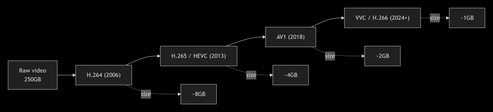
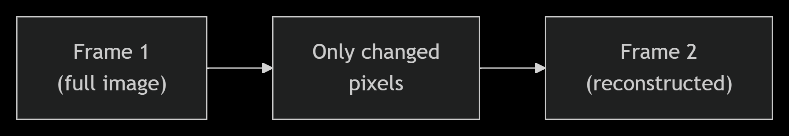
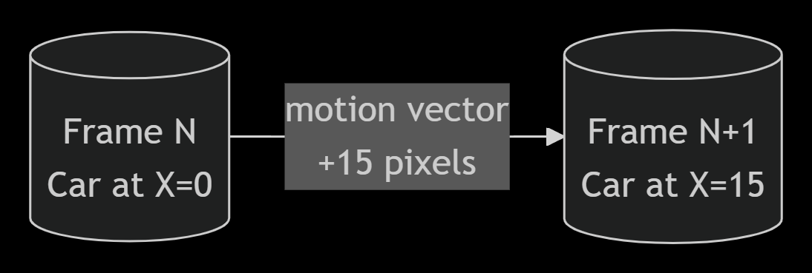
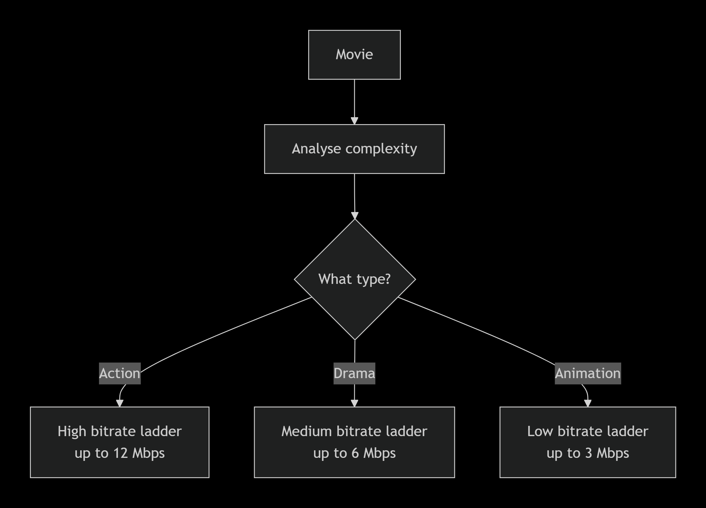
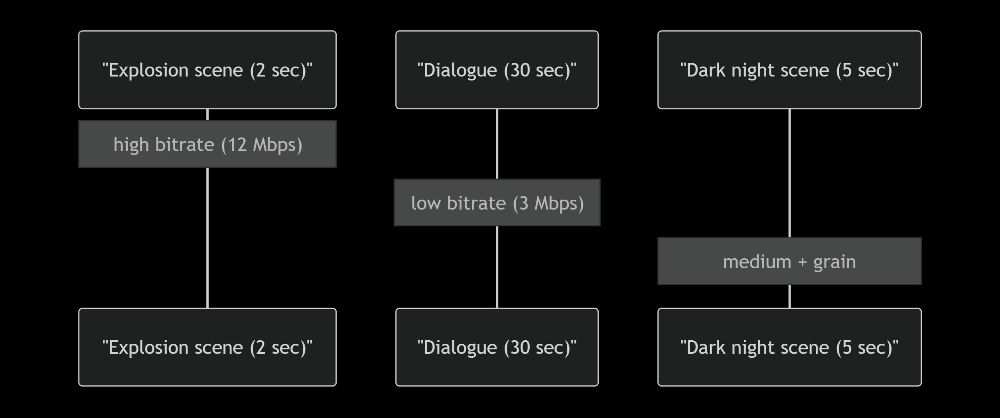
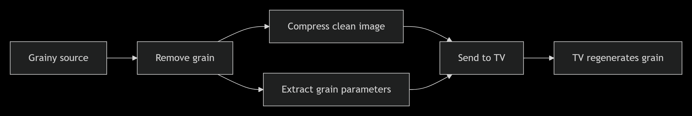
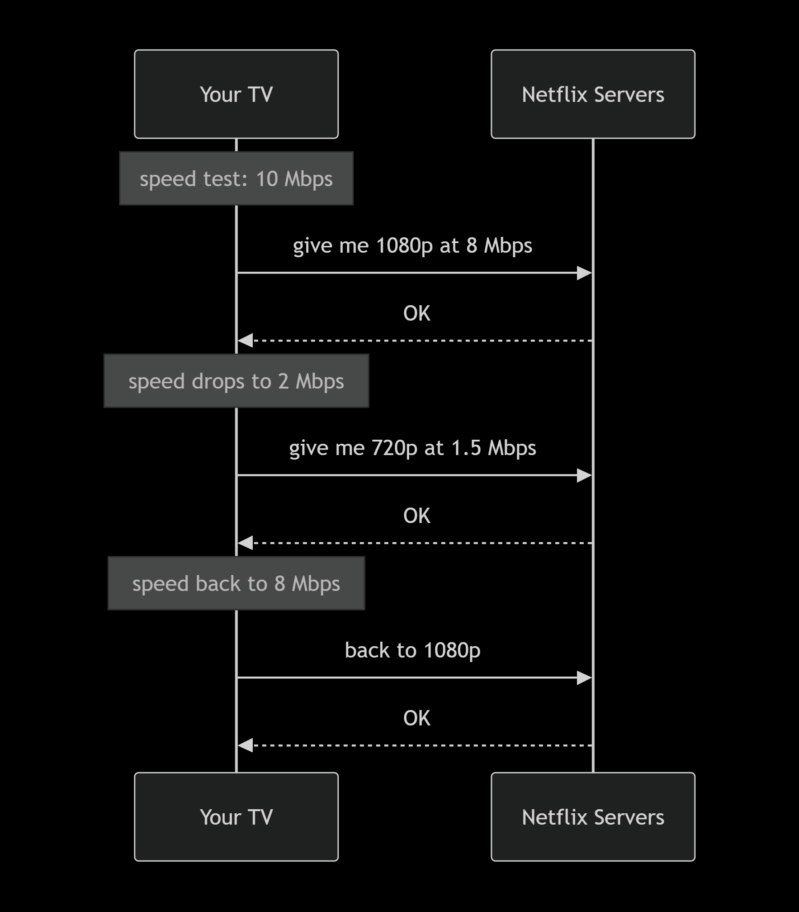

# How Netflix squeezes a 250GB movie into 1.5GB (and you never notice)

I was watching Interstellar last week and my internet dropped for a second. It buffered for maybe half a second, then carried on. No pixelation, nothing. Just continued.

That got me thinking. The Blu-ray of Interstellar is around 50GB. Netflix sent me that same film in maybe 3GB and it looked fine on my TV. How does that even work?

So I went down a rabbit hole. This is what I found.

---

## First, just how big is a movie really?

Let's do some napkin math. A 1080p frame is 1920 by 1080 pixels, which is roughly 2 million pixels. Each pixel stores 24 bits of colour. So one frame is about 6 megabytes. At 24 frames per second, that's 150 megabytes every second. A two and a half hour film would be over 1.3 terabytes uncompressed.

In practice, raw video already throws away some colour data. Your eyes are much better at seeing brightness than colour, so video has always stored less colour than brightness. That gets a raw master down to around 250 gigabytes for a feature film.

Yes, 250GB. For one movie.

That's the problem codecs exist to solve.

---

## What a codec actually does

A codec is just a collection of tricks for removing data you won't notice is missing. Every generation of codec adds smarter tricks.

Netflix runs all of them. Newer devices get AV1. Older hardware falls back to H.264. H.265 is technically excellent but has a complicated patent situation, so Netflix has been shifting toward AV1 wherever they can.

---

## The three main tricks

### Only send what changed

Most of a film is the same background. Two people talking in a kitchen? The wall, the counter, the window behind them don't move between frames.

So instead of sending a full image 24 times a second, the codec sends a complete frame occasionally (a keyframe) and for everything in between it just sends the pixels that changed. This is called motion estimation.

For a slow dialogue scene this can cut the data by 90%. For something like a battle scene where everything is moving, the savings are smaller, but they're still there.

### Your eyes fill in gaps you don't know are there

This one surprised me when I first read about it. Codecs deliberately throw away detail, but they do it in ways calibrated to how human vision works.

You see brightness much more sharply than colour, so the codec stores less colour information per pixel. You're also better at seeing large shapes than fine texture, so the codec softens tiny details. In dark scenes your perception of noise drops off significantly, so the codec is more aggressive there.

It's lossy, but if it's done well you genuinely can't tell.

### Motion vectors

Say there's a car moving across the screen. Instead of redrawing that car pixel by pixel 24 times a second, the codec says: take this block of pixels from the previous frame and shift it 20 pixels to the right. That instruction, the direction and distance of movement, is called a motion vector. It costs almost nothing to store.

This works really well for camera pans, tracking shots, anything where the image is moving as a whole.

---

## The part where Netflix got clever

The codecs above existed for years. What Netflix figured out was that the settings matter a lot, and the right settings depend entirely on what you're compressing.

An action film with constant movement and explosions needs a high bitrate or it turns into a blurry mess. A slow drama with lots of static wide shots can be compressed much more aggressively and still look fine. Running both through the same encoder with the same settings is wasteful for one and insufficient for the other.

So Netflix built a system that analyses each title before encoding it and works out the minimum bitrate needed to hit a target quality score. They call it per-title encoding.

That alone saved them a significant chunk of bandwidth.

Then they went further. Why treat a whole film as one thing? An action sequence needs high bitrate. The quiet conversation two scenes later doesn't. So now they break films into individual shots, sometimes thousands of them, and encode each one separately.

It's a lot of compute, but the quality-to-size ratio is noticeably better.

---

## Film grain nearly broke this whole system

I ran into this personally when I was playing around with compressing some old films. Anything shot on film in the 70s or 80s has grain baked into it. Grain looks like random pixel noise to a codec. And codecs really struggle with randomness because you can't predict what comes next, you can't use motion vectors, you can't skip unchanged regions. It forces the encoder to just store all of it.

Netflix's fix was to strip the grain out before encoding, then add it back synthetically on the viewer's device at playback.

The generated grain isn't identical to the original, but it's indistinguishable to viewers. And the bitrate savings on grainy films can be up to 50%.

---

## Actually getting it to your screen

All of this is useless if your connection drops. So Netflix doesn't commit to a single quality level for a stream. Your device is constantly reporting how fast it can download, and it requests a matching quality tier. If your speed drops, the next chunk comes in at lower quality. If it recovers, quality goes back up.

The switches are designed to be invisible. You'd only notice if you were specifically watching for them.

---

## Rough numbers across the whole pipeline

| Step | Approximate size |
| :--- | :--- |
| Raw master | 250 GB |
| After H.264 (traditional) | about 8 GB |
| After per-title encoding + H.265 | about 4 GB |
| After shot-based encoding + AV1 | about 2 GB |
| After film grain synthesis | about 1.5 GB |

So that's roughly a 99% reduction, and on a decent TV you'd struggle to see the difference from the original.

There's also audio (Dolby Atmos, etc.), 4K with HDR, and a whole field of perceptual quality metrics like VMAF that I didn't get into here. Maybe another time.

---

*I work on test automation and cloud infrastructure at WithSecure. Video compression is something I fell into by accident and haven't been able to stop reading about since. If you want to talk about it, I'm on [LinkedIn](https://linkedin.com/in/rohith-kumar-prasanna-kumar) or reachable at [rohith@rohithkumar.dev](mailto:rohith@rohithkumar.dev).*

*Rohith*
